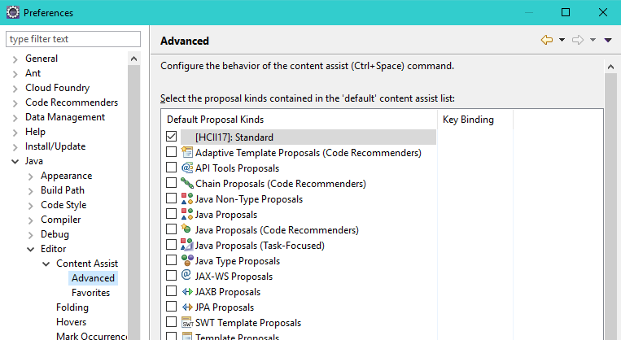
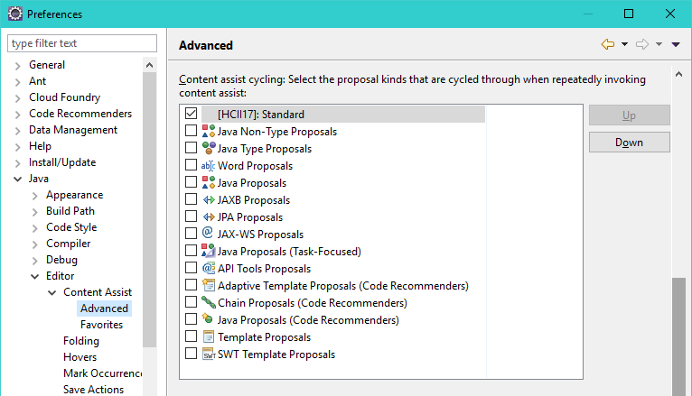

# HCII17

Here you will find all Java projects and instructions to conduct the experiment reported on 
_On Source Code Completion Assistants and the Need of a Context-Aware Approach_.

## Experiment overview
The experiment aims to collect and interpret usage information regarding two [Eclipse Neon 4.6.1](https://eclipse.org/neon/) code assistants that differ in the approaches used to filter and sort the list of possible completions. The first assistant is the longtime default option that ships with the Eclipse IDE, which filters completions according to the restrictions of code structure and method and variable visibility and scope, and sorts completions alphabetically and eventually according to the expected return type of an expression. The second assistant is the popular [Code Recommenders](https://eclipse.org/recommenders) that adds sorting features that rely upon predefined statistical usage models.

### The programming tasks
A number of programming tasks were designed to observe how professional software developers use code code assistants. All tasks can be found in project `programming-tasks` and they all considered the _fill-in-the-blanks_ approach seen below, in which software developers should replace invalid or incomplete statements according to a set of given instructions.
```java
public static String encode(byte[] input) {

    if (input == null || Array.getLength(input) == 0) {
        throw new IllegalArgumentException();
    }
    
    // ********************************************************************************
    // *
    // * Find a method to get a Base64 encoder
    // *
    // ********************************************************************************
    //
    // Once you find the right method, your statement will look like this:
    // (Please note that terms 'TYPE_OR_OBJECT' e 'METHOD' are to be replaced)
    //
    // Encoder encoder = TYPE_OR_OBJECT.METHOD;
    //
    // ********************************************************************************
    Encoder encoder = replaceMe_1; 

    ...
}
```
Each programming task is represented by two classes; the main class and the unit test class. The main classe has a clear goal, which can be found in the comments section. The unit tests class is designed to assert whether the task was indeed complete without providing too detailed feedback.

### Observing interactions and extending code assistants
To actually observe how software programmers interact with code asistants we created the `code-assistants` project. It adds a logging layer to the ordinary code assistants that ship with [Eclipse IDE](https://www.eclipse.org) which records how many times a particular code assistant was invoked, how long it was active, the user input (if any) once the assistant was invoked and the eventual user choice.
In order to do so we define a few [extension points](http://www.vogella.com/tutorials/EclipseExtensionPoint/article.html) of type `org.eclipse.jdt.ui.javaCompletionProposalComputer` (see reference documentation [here](http://help.eclipse.org/neon/index.jsp?topic=%2Forg.eclipse.jdt.doc.isv%2Freference%2Fextension-points%2Forg_eclipse_jdt_ui_javaCompletionProposalComputer.html)) that extend the ordinary implementations (take a look at the [plugin.xml](/code-assistants/src/main/resources/plugin.xml) file to see how extension points are defined).

You can modify implementations at your own will, and since the `code-assistants` was designed as an ordinary [Maven](https://www.maven.org) project then all you have to do to build it is to choose which profile suites you best (`standard` or `intelligent`) and run a simple
```sh
$ mvn -P[profile] clean package
```

Once a build is successful the resulting artifact will be an ordinary JAR file named `[profile]_hcii17-code-assistants_1.0.0.jar`.

*Please note that despite functional, these extensions access a few internal APIs and thus they do not follow Eclipse plugin coding guidelines.*

#### Enabling and disabling custom extensions
The Maven build profiles mentioned earlier already do trick for you. However, you can also modify the [plugin.xml](/code-assistants/src/main/resources/plugin.xml) file at your own discretion to enable or disable a particular extension. Use XMLs comment marks to do so and remember that since `plugin.xml` is embedded in the JAR file you should rebuild `code-assistants` at every change.
```xml
  <!-- This is an extension of the standard code completion assistant -->
  <extension point="org.eclipse.jdt.ui.javaCompletionProposalComputer"
      id="br.edu.fei.hcii17.codeassist.javaCompletionProposalComputer.std"
      name="[HCII17]: Standard">
    <javaCompletionProposalComputer
        activate="true"
        categoryId="br.edu.fei.hcii17.codeassist.std"
        class="br.edu.fei.hcii17.codeassist.StandardCompletionExtension">
    </javaCompletionProposalComputer>   
  </extension>
```

#### Log files
Log files are defined in the [logging.properties](/code-assistants/src/main/resources/logging.properties) file, which is also embedded in the JAR file. You can set the log location and log level, but a standard log file should like this:
```
...
INFO 2017-02-01 20:21:57,768 StandardCompletionExtension - Session started.
INFO 2017-02-01 20:21:57,783 StandardCompletionExtension - [Task01.java] - There are 37 completion proposals for 'if (from.'.
INFO 2017-02-01 20:22:01,929 StandardCompletionExtension - Session was active for 4 seconds.
...
```

## Running the experiment
Prepare a custom [Eclipse Neon 4.6.1](https://eclipse.org/neon/) distribution by placing the resulting JAR file of a `code-assistants` build in the `dropins` folder. Please use one JAR file at a time. 

### Choosing the programming tasks
Select the programming tasks that are more suitable to your target audience and create a workspace. Assign to each participant a set pair of programming task and code assistant, and be sure that the contents of the `dropins` folder match this configuration. That is, if you should complete `Task01` with the `standard` code assistant then make sure that the `standard_hcii17-code-assistants_1.0.0.jar` is the only JAR file in `dropins` folder. On the other hand, if you should complete `Task02` with the `intelligent` code assistant then make sure that `intelligent_hcii17-code-assistants_1.0.0.jar` is the only file out there.

### Deactivating code assistants
The last step before completing a task is to make sure that all default code assistants available in Eclipse are disabled. 
To do so, go to `Window > Preferences` menu and navigate to the `Java > Editor > Code Assist > Advanced` option.
Make sure that the HCII17 code assistant is the only option selected both in the _default_ section


and in the _content assist cycling_ section


## Parsing log files
You can use the `log-parser` tool to interpret the results of your experiment. Take a look at the `MainApp` class and do the proper modifications. If you run it using the sample log files we provide you should get the following result:
```
-------------------------------------------------------------------------------------------------------------
(1)	(2)	(3)	(4)	(5)	(6)	  	(7) 	  	(8) 	  	  	(9) 	(10)
ID 	Exp	Tsk	Dur	Ast	Act	DT	AvgDT	P	AvgP	AP	CP	APR 	CPR
-------------------------------------------------------------------------------------------------------------
01	E	01	3511	STD	101	2112	20.91	3556	35.21	53	10	52.48	18.87
01	E	02	2206	INT	40	1229	30.73	1495	37.38	18	11	45.00	61.11
01	E	03	914	INT	22	438	19.91	1078	49.00	12	7	54.55	58.33
02	I	01	503	INT	16	397	24.81	757	47.31	10	7	62.50	70.00
02	I	02	691	INT	51	239	4.69	1190	23.33	30	19	58.82	63.33
02	I	03	225	STD	10	465	46.50	354	35.40	5	4	50.00	80.00
03	E	01	1539	STD	34	1034	30.41	4604	135.41	16	7	47.06	43.75
03	E	02	2034	INT	57	854	14.98	3366	59.05	26	7	45.61	26.92
03	E	03	589	INT	13	456	35.08	599	46.08	6	5	46.15	83.33
04	E	01	1879	STD	116	1416	12.21	8462	72.95	40	7	34.48	17.50
04	E	02	738	INT	51	495	9.71	3619	70.96	22	14	43.14	63.64
04	E	03	611	INT	34	509	14.97	1011	29.74	10	4	29.41	40.00
05	E	01	664	INT	14	360	25.71	2020	144.29	8	7	57.14	87.50
05	E	02	2593	INT	86	1746	20.30	4473	52.01	44	18	51.16	40.91
05	E	03	869	STD	25	701	28.04	2722	108.88	15	9	60.00	60.00
06	I	01	6144	INT	194	3355	17.29	10101	52.07	84	18	43.30	21.43
06	I	02	1930	STD	100	876	8.76	10056	100.56	34	13	34.00	38.24
06	I	03	471	INT	20	505	25.25	726	36.30	9	5	45.00	55.56
07	I	01	3749	INT	202	2294	11.36	7071	35.00	104	22	51.49	21.15
07	I	02	1421	INT	66	518	7.85	2667	40.41	37	27	56.06	72.97
07	I	03	373	INT	19	145	7.63	734	38.63	10	3	52.63	30.00
08	U	01	2859	INT	88	1223	13.90	4493	51.06	60	12	68.18	20.00
08	U	02	4066	INT	195	2497	12.81	6608	33.89	108	48	55.38	44.44
08	U	03	1388	STD	56	644	11.50	6518	116.39	40	13	71.43	32.50
09	E	01	3257	INT	103	1689	16.40	6990	67.86	58	13	56.31	22.41
09	E	02	3232	STD	78	1132	14.51	4630	59.36	45	22	57.69	48.89
09	E	03	890	INT	23	425	18.48	994	43.22	13	4	56.52	30.77
-------------------------------------------------------------------------------------------------------------
```

Columns (1) and (2) display the participant's index and the reported programming expertise (U stands for unexperienced, I for intermediate and E for experienced). Columns (3) and (4) display the taks and overall duration in seconds. Columns (5) and (6) display the code assistants (STD stands for standard and INT for intelligent) and how manby times it was activated. Columns (7) refers to the average display time of each code assistants. Column (8) displays the average number of actviations. Finally, column (1) displays the ratio of applied proposals that actually contribute to task completion.

Log parsing can also give you a lot of interesting data, like the top 10 suggestions per task. See below the `Task01` example.
```
------------------------------------------------------------------------------------------------
Cnt	%	Suggestion
------------------------------------------------------------------------------------------------
35	8.08	from : Path
21	4.85	visitor : FileVisitor<java.nio.file.Path>
20	4.62	Path - java.nio.file
19	4.39	isDirectory() : boolean - File
15	3.46	walkFileTree(Path start, FileVisitor<? super Path> visitor) : Path - Files
13	3.00	visitFile(Path file, BasicFileAttributes attrs) : FileVisitResult - FileVisitor
13	3.00	copy(Path source, Path target, CopyOption... options) : Path - Files
12	2.77	toFile() : File - Path - 5% 
11	2.54	toAbsolutePath() : Path - Path
10	2.31	isAbsolute() : boolean - Path
-------------------------------------------------------------------------------------------------
```
